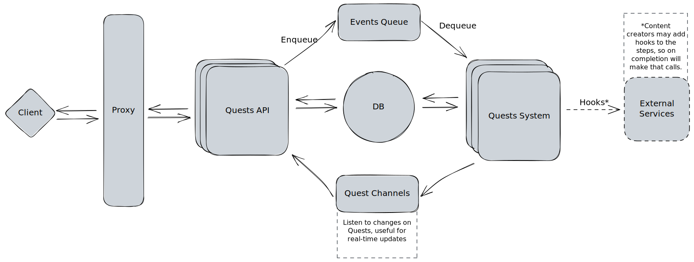

<p align="center">
  <a href="https://decentraland.org">
    
  </a>
</p>
<h1 align="center">
  Decentraland Quests
</h1>

The Quests System is an important feature that facilitates users to explore the world, unlock achievements and potentially receive rewards. A quest is a series of steps or tasks that a user has to complete. Each step or task has an acceptance criteria to consider it as done. A quest designer has to define the steps and the order or the path to the end, so the quest is finished when those steps are completed.

# Setup

Before start, make sure you have these installed:
- **Rust** | you can use this [Development setup guide](https://www.notion.so/decentraland/Development-Setup-3ea6715744944d1cbab0bf569f329f06) 
- **docker-compose** | used for DB and Redis

# Run

Before running the Quests server you need Postgres and Redis instances, you can start both by running:
```console
$ make runservices
```

In order to run the Quests Server:
```console
$ cargo run -p quests_server
```

Also, you can run it in watch mode by installing `cargo-watch` and using the command to run the server:
```console
$ cargo install cargo-watch
$ cargo watch -x 'run -p quests_server'
```

## Logging
The `RUST_LOG` environment variable can be used to specify the log level, for example:

```console
$ RUST_LOG=debug cargo run -p quests_server
```
_See [these docs](https://docs.rs/env_logger/latest/env_logger/) to understand the possible values._

## Testing

You can use `cargo test` or leverage on the _Makefile_ to guarantee services tear up and down (DB and Redis):

- `make tests`: run all tests
- `make test-server`: run server specific tests
- `make test-db`: run database specific tests
- `make test-protocol`: run protocol specific tests
- `make message-broker`: run message broker specific tests
- `make test-system`: run system specific tests

# Architecture
Here is a highlevel architecture overview that can help to understand the project strucuture and components:


