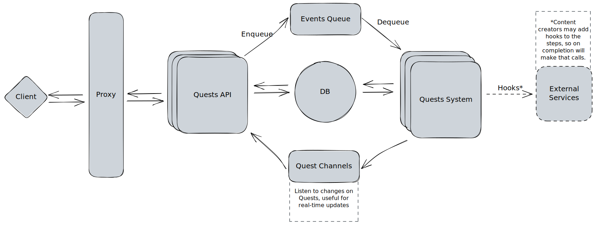

<p align="center">
  <a href="https://decentraland.org">
    
  </a>
</p>
<h1 align="center">
  Decentraland Quests
</h1>

The Quests System is an important feature that facilitates users to explore the world, unlock achievements and potentially receive rewards. A quest is a series of steps or tasks that a user has to complete. Each step or task has an acceptance criteria to consider it as done. A quest designer has to define the steps and the order or the path to the end, so the quest is finished when those steps are completed.

# Setup

Before start, make sure you have these installed:
- Rust
  - [Development Setup](https://www.notion.so/decentraland/Development-Setup-3ea6715744944d1cbab0bf569f329f06)
- docker-compose

## Use the project

This project makes use of Postgres and Redis, you can start both by running:
```shell
make runservices
```

## Quests Server
In order to run the Quests Server API:
```shell
cargo run -p quests_server
```

In order to run the Quests Server API in dev mode (adds the watch mode), you should use the below command:
```shell
cargo install cargo-watch 'if cargo-watch is not installed
cargo watch -x 'run -p quests_server'
```

## Quests System
In order tu run the Quests System, you should use the next `make` commanad from the project's root:
```shell
cargo run -p quests_server
```

In order to run the Quests System in dev mode (adds the watch mode), you should use the below command:
```shell
cargo install cargo-watch 'if cargo-watch is not installed
cargo watch -x 'run -p quests_system'
```

## Logs
The `RUST_LOG` environment variable can be used to specify the log level, see [these docs](https://docs.rs/env_logger/latest/env_logger/) to understand the possible values, for example:

```shell
RUST_LOG=debug cargo run -p quests_server
```

### Testing
In order to run all project's tests, you should run the next command:
```shell
make tests
```

To run specfic test, there are some useful commands:
- Quests Server:
```shell
make test-server
```
- Quests Database:
```shell
make test-db
```
- Quests Protocol:
```shell
make test-protocol
```

# Architecture
Here is a highlevel architecture overview that can help to understand the project strucuture and components:


